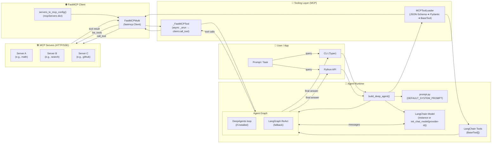
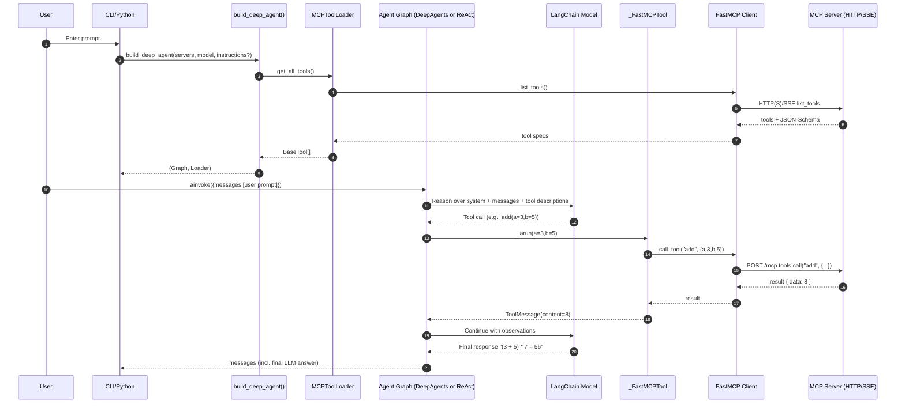
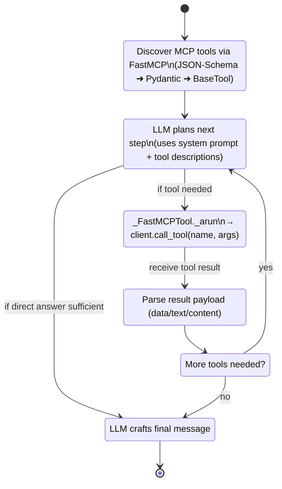
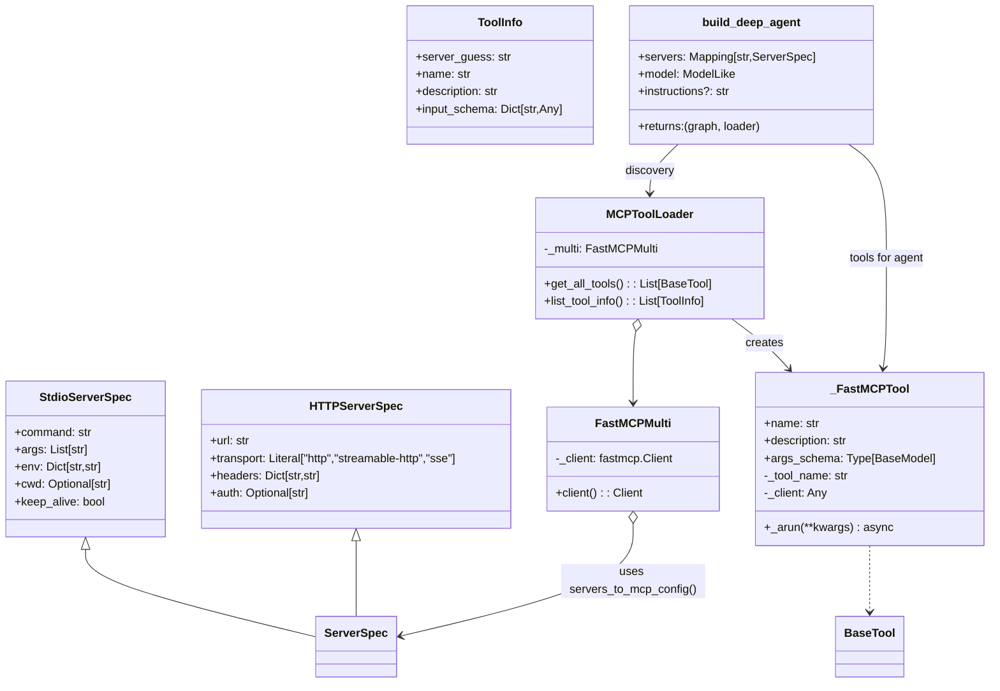
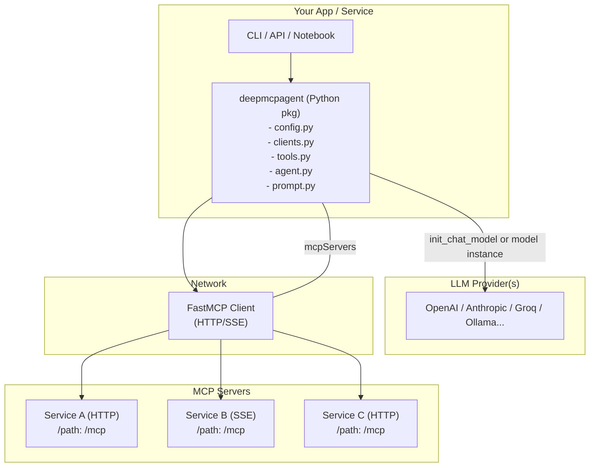
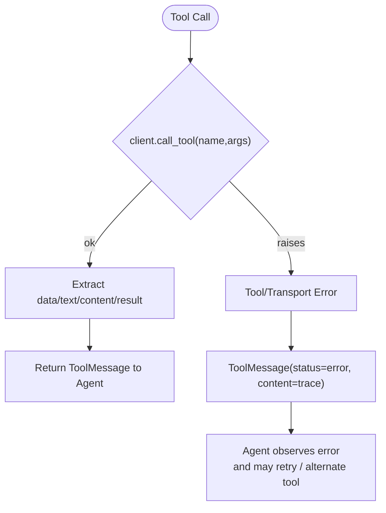

<!-- Banner / Title -->
<div align="center">
  

  <h1>🤖 DeepMCPAgent</h1>
  <p><strong>Model-agnostic LangChain/LangGraph agents powered entirely by <a href="https://modelcontextprotocol.io/">MCP</a> tools over HTTP/SSE.</strong></p>

  <!-- Badges -->
  <p>
    <a href="https://github.com/cryxnet/deepmcpagent/actions/workflows/ci.yml">
      
    </a>
    <a href="https://cryxnet.github.io/deepmcpagent">
      
    </a>
    <a href="#"></a>
    <a href="#"></a>
    <a href="#"></a>
  </p>

  <p>
    <em>Discover MCP tools dynamically. Bring your own LangChain model. Build production-ready agents—fast.</em>
  </p>

  <p>
    📚 <a href="https://cryxnet.github.io/deepmcpagent/">Documentation</a> • 🛠 <a href="https://github.com/cryxnet/deepmcpagent/issues">Issues</a>
  </p>
</div>

<hr/>

## ✨ Why DeepMCPAgent?

- 🔌 **Zero manual tool wiring** — tools are discovered dynamically from MCP servers (HTTP/SSE)
- 🌐 **External APIs welcome** — connect to remote MCP servers (with headers/auth)
- 🧠 **Model-agnostic** — pass any LangChain chat model instance (OpenAI, Anthropic, Ollama, Groq, local, …)
- ⚡ **DeepAgents (optional)** — if installed, you get a deep agent loop; otherwise robust LangGraph ReAct fallback
- 🛠️ **Typed tool args** — JSON-Schema → Pydantic → LangChain `BaseTool` (typed, validated calls)
- 🧪 **Quality bar** — mypy (strict), ruff, pytest, GitHub Actions, docs

> **MCP first.** Agents shouldn’t hardcode tools — they should **discover** and **call** them. DeepMCPAgent builds that bridge.

---

## 🚀 Installation

Install from [PyPI](https://pypi.org/project/deepmcpagent/):

```bash
pip install "deepmcpagent[deep]"
```

This installs DeepMCPAgent with **DeepAgents support (recommended)** for the best agent loop.
Other optional extras:

- `dev` → linting, typing, tests
- `docs` → MkDocs + Material + mkdocstrings
- `examples` → dependencies used by bundled examples

```bash
# install with deepagents + dev tooling
pip install "deepmcpagent[deep,dev]"
```

⚠️ If you’re using **zsh**, remember to quote extras:

```bash
pip install "deepmcpagent[deep,dev]"
```

---

## 🚀 Quickstart

### 1) Start a sample MCP server (HTTP)

```bash
python examples/servers/math_server.py
```

This serves an MCP endpoint at: **[http://127.0.0.1:8000/mcp](http://127.0.0.1:8000/mcp)**

### 2) Run the example agent (with fancy console output)

```bash
python examples/use_agent.py
```

**What you’ll see:**


---

## 🧑‍💻 Bring-Your-Own Model (BYOM)

DeepMCPAgent lets you pass **any LangChain chat model instance** (or a provider id string if you prefer `init_chat_model`):

```python
import asyncio
from deepmcpagent import HTTPServerSpec, build_deep_agent

# choose your model:
# from langchain_openai import ChatOpenAI
# model = ChatOpenAI(model="gpt-4.1")

# from langchain_anthropic import ChatAnthropic
# model = ChatAnthropic(model="claude-3-5-sonnet-latest")

# from langchain_community.chat_models import ChatOllama
# model = ChatOllama(model="llama3.1")

async def main():
    servers = {
        "math": HTTPServerSpec(
            url="http://127.0.0.1:8000/mcp",
            transport="http",    # or "sse"
            # headers={"Authorization": "Bearer <token>"},
        ),
    }

    graph, _ = await build_deep_agent(
        servers=servers,
        model=model,
        instructions="Use MCP tools precisely."
    )

    out = await graph.ainvoke({"messages":[{"role":"user","content":"add 21 and 21 with tools"}]})
    print(out)

asyncio.run(main())
```

> Tip: If you pass a **string** like `"openai:gpt-4.1"`, we’ll call LangChain’s `init_chat_model()` for you (and it will read env vars like `OPENAI_API_KEY`). Passing a **model instance** gives you full control.

---

## 🖥️ CLI (no Python required)

```bash
# list tools from one or more HTTP servers
deepmcpagent list-tools \
  --http name=math url=http://127.0.0.1:8000/mcp transport=http \
  --model-id "openai:gpt-4.1"

# interactive agent chat (HTTP/SSE servers only)
deepmcpagent run \
  --http name=math url=http://127.0.0.1:8000/mcp transport=http \
  --model-id "openai:gpt-4.1"
```

> The CLI accepts **repeated** `--http` blocks; add `header.X=Y` pairs for auth:
>
> ```
> --http name=ext url=https://api.example.com/mcp transport=http header.Authorization="Bearer TOKEN"
> ```

---

## 🧩 Architecture (at a glance)

```
┌────────────────┐        list_tools / call_tool        ┌─────────────────────────┐
│ LangChain/LLM  │  ──────────────────────────────────▶ │ FastMCP Client (HTTP/SSE)│
│  (your model)  │                                      └───────────┬──────────────┘
└──────┬─────────┘  tools (LC BaseTool)                               │
       │                                                              │
       ▼                                                              ▼
  LangGraph Agent                                    One or many MCP servers (remote APIs)
  (or DeepAgents)                                    e.g., math, github, search, ...
```

- `HTTPServerSpec(...)` → **FastMCP client** (single client, multiple servers)
- **Tool discovery** → JSON-Schema → Pydantic → LangChain `BaseTool`
- **Agent loop** → DeepAgents (if installed) or LangGraph ReAct fallback

---

## Full Architecture & Agent Flow

### 1) High-level Architecture (modules & data flow)



---

### 2) Runtime Sequence (end-to-end tool call)



---

### 3) Agent Control Loop (planning & acting)



---

### 4) Code Structure (types & relationships)



---

### 5) Deployment / Integration View (clusters & boundaries)



---

### 6) Error Handling & Observability (tool errors & retries)



---

> These diagrams reflect the current implementation:
>
> - **Model is required** (string provider-id or LangChain model instance).
> - **MCP tools only**, discovered at runtime via **FastMCP** (HTTP/SSE).
> - Agent loop prefers **DeepAgents** if installed; otherwise **LangGraph ReAct**.
> - Tools are typed via **JSON-Schema ➜ Pydantic ➜ LangChain BaseTool**.
> - Fancy console output shows **discovered tools**, **calls**, **results**, and **final answer**.

---

## 🧪 Development

```bash
# install dev tooling
pip install -e ".[dev]"

# lint & type-check
ruff check .
mypy

# run tests
pytest -q
```

---

## 🛡️ Security & Privacy

- **Your keys, your model** — we don’t enforce a provider; pass any LangChain model.
- Use **HTTP headers** in `HTTPServerSpec` to deliver bearer/OAuth tokens to servers.

---

## 🧯 Troubleshooting

- **PEP 668: externally managed environment (macOS + Homebrew)**
  Use a virtualenv:

  ```bash
  python3 -m venv .venv
  source .venv/bin/activate
  ```

- **404 Not Found when connecting**
  Ensure your server uses a path (e.g., `/mcp`) and your client URL includes it.
- **Tool calls failing / attribute errors**
  Ensure you’re on the latest version; our tool wrapper uses `PrivateAttr` for client state.
- **High token counts**
  That’s normal with tool-calling models. Use smaller models for dev.

---

## 📄 License

Apache-2.0 — see [`LICENSE`](/LICENSE).

---

## 🙏 Acknowledgments

- The **MCP** community for a clean protocol.
- **LangChain** and **LangGraph** for powerful agent runtimes.
- **FastMCP** for solid client & server implementations.
