<!-- Banner / Title -->
<div align="center">
  

  <h1>🤖 OneShotMCP</h1>
  <p><strong>One prompt. Zero setup. Infinite MCP tools.</strong></p>
  <p><em>Model-agnostic LangChain/LangGraph agents with <strong>automatic MCP server discovery</strong> via Smithery registry.</em></p>

  <!-- Badges -->
  <p>
    <a href="https://cryxnet.github.io/DeepMCPAgent">
      
    </a>
    <a href="#"></a>
    <a href="#"></a>
    <a href="#"></a>

<p>
  <a href="https://www.producthunt.com/products/deep-mcp-agents?utm_source=badge-featured&utm_medium=badge&utm_source=badge-deep-mcp-agents" target="_blank">
    
  </a>
</p>
  </p>

  <p>
    <em>Ask for GitHub data → agent auto-discovers GitHub MCP server → executes your task. No manual configuration.</em>
  </p>

  <p>
    📚 <a href="https://cryxnet.github.io/deepmcpagent/">Documentation</a> • 🛠 <a href="https://github.com/cryxnet/deepmcpagent/issues">Issues</a>
  </p>
</div>

<hr/>

## ✨ Why OneShotMCP?

### 🚀 NEW: Automatic Tool Discovery

**The Problem:** Traditional agents require you to manually configure every MCP server upfront.

**OneShotMCP Solution:** Agents automatically discover and add MCP servers from the [Smithery registry](https://smithery.ai) when they need capabilities they don't have.

```python
# You: "Search GitHub for MCP servers"
# Agent: "I don't have GitHub tools... searching Smithery... found @smithery-ai/github... adding server... retrying..."
# Agent: "Here are 10 MCP servers on GitHub..."
```

### Core Features

- 🎯 **One-shot tool discovery** — ask for anything, agent finds the right MCP server automatically
- 🔌 **Zero manual setup** — start with zero servers, agent discovers what it needs on-the-fly
- 📦 **Smithery registry integration** — access 100+ MCP servers via automatic search
- 🧠 **Model-agnostic** — works with any LangChain model (OpenAI, Anthropic, Ollama, Groq, local, …)
- ⚡ **DeepAgents support** — uses DeepAgents loop if installed, LangGraph ReAct otherwise
- 🛠️ **Type-safe** — JSON-Schema → Pydantic → LangChain `BaseTool` (fully typed, validated)
- 🔄 **Stateful conversations** — messages persist across agent rebuilds when adding new servers
- 🧪 **Production-ready** — strict mypy, ruff, pytest, full test coverage

> **MCP evolved.** Agents shouldn't just discover tools from configured servers — they should **discover the servers themselves**. OneShotMCP completes the vision.

---

## 🚀 Installation

Install from [PyPI](https://pypi.org/project/oneshotmcp/):

```bash
pip install "oneshotmcp[deep]"
```

This installs OneShotMCP with **DeepAgents support (recommended)** for the best agent loop.
Other optional extras:

- `deep` → DeepAgents loop (recommended)
- `dev` → linting, typing, tests
- `docs` → MkDocs + Material + mkdocstrings
- `examples` → dependencies used by bundled examples

```bash
# install with deepagents + dev tooling
pip install "oneshotmcp[deep,dev]"
```

⚠️ If you're using **zsh**, remember to quote extras:

```bash
pip install "oneshotmcp[deep,dev]"
```

---

## 🚀 Quickstart

### Dynamic Mode (Auto-Discovery) - NEW! ✨

**Zero configuration needed** — the agent discovers MCP servers on-demand from the Smithery registry.

```bash
# Set up your API keys
export SMITHERY_API_KEY="your_smithery_key"  # Get from https://smithery.ai
export TAVILY_API_KEY="tvly-..."            # Optional: Get from https://tavily.com for web search

# Optional: Configure model (defaults to gpt-4.1-nano)
export ONESHOT_MODEL="openai:gpt-4"          # Or anthropic:claude-sonnet-3.5-v2, etc.

# Run the agent (that's it!)
oneshot

# With Tavily: starts with web search capability pre-configured
# Without Tavily: starts with zero servers, discovers on-demand

# Or try the example script
python examples/dynamic_agent.py
```

**💡 Pro Tip:** Set `TAVILY_API_KEY` to enable instant web search without discovery delay!

**What happens:**
1. **You (with Tavily):** "Research the latest AI developments"
   - **Agent:** Uses pre-configured Tavily → instant web search → comprehensive results ✓
2. **You:** "Search GitHub for MCP servers"
   - **Agent:** Detects needs GitHub tools → searches Smithery → discovers server → retries → success ✓
3. **Follow-up:** "How many stars does the first repo have?"
   - **Agent:** Uses already-discovered GitHub server → instant response ✓

### Static Mode (Pre-configured Servers)

If you prefer to specify servers upfront:

```bash
# 1) Start a sample MCP server (HTTP)
python examples/servers/math_server.py
# Serves at: http://127.0.0.1:8000/mcp

# 2) Run the agent with pre-configured server
python examples/use_agent.py
```

**What you'll see:**


---

## 🧑‍💻 Usage Guide

### Dynamic Discovery (Python API)

The `DynamicOrchestrator` automatically discovers and adds MCP servers when the agent needs capabilities it doesn't have:

```python
import asyncio
from oneshotmcp import DynamicOrchestrator

async def main():
    # Create orchestrator with zero initial servers
    orchestrator = DynamicOrchestrator(
        model="openai:gpt-4.1-nano",       # Or any LangChain model instance
        initial_servers={},                # Start with nothing!
        smithery_key="your_smithery_key",  # From https://smithery.ai
        instructions="You are a helpful assistant.",
        verbose=True,                      # Show LLM reasoning and tool calls
    )

    # Ask for something requiring GitHub tools (not configured)
    response = await orchestrator.chat("Search GitHub for MCP servers")
    # → Agent detects missing tools → searches Smithery → adds GitHub server → retries
    print(response)

    # Follow-up uses the same GitHub server
    response = await orchestrator.chat("How many stars does the first repo have?")
    print(response)

    # Ask about weather (triggers discovery of weather server)
    response = await orchestrator.chat("What's the weather in San Francisco?")
    print(response)

    print(f"Servers discovered: {list(orchestrator.servers.keys())}")
    # → ['github', 'weather']

asyncio.run(main())
```

**Key Benefits:**
- 🎯 Start with **zero servers** — no upfront configuration
- 🔄 **State persists** across rebuilds — conversation history maintained
- 🔍 **Automatic capability detection** — pattern matching on agent responses
- 📦 **Smithery integration** — access to 100+ MCP servers

### Static Configuration (Python API)

For production scenarios where you know which servers you need upfront.

OneShotMCP lets you pass **any LangChain chat model instance** (or a provider id string via `init_chat_model`):

```python
import asyncio
from oneshotmcp import HTTPServerSpec, build_deep_agent

# choose your model:
# from langchain_openai import ChatOpenAI
# model = ChatOpenAI(model="gpt-4.1")

# from langchain_anthropic import ChatAnthropic
# model = ChatAnthropic(model="claude-3-5-sonnet-latest")

# from langchain_community.chat_models import ChatOllama
# model = ChatOllama(model="llama3.1")

async def main():
    servers = {
        "math": HTTPServerSpec(
            url="http://127.0.0.1:8000/mcp",
            transport="http",    # or "sse"
            # headers={"Authorization": "Bearer <token>"},
        ),
    }

    graph, _ = await build_deep_agent(
        servers=servers,
        model=model,
        instructions="Use MCP tools precisely."
    )

    out = await graph.ainvoke({"messages":[{"role":"user","content":"add 21 and 21 with tools"}]})
    print(out)

asyncio.run(main())
```

> Tip: If you pass a **string** like `"openai:gpt-4.1"`, we’ll call LangChain’s `init_chat_model()` for you (and it will read env vars like `OPENAI_API_KEY`). Passing a **model instance** gives you full control.

---

## 🖥️ CLI (no Python required)

### Dynamic Mode (Auto-Discovery)

```bash
# Interactive agent with automatic MCP server discovery
deepmcpagent run-dynamic \
  --model-id "openai:gpt-4" \
  --smithery-key "$SMITHERY_API_KEY"

# With optional initial servers (hybrid mode)
deepmcpagent run-dynamic \
  --model-id "openai:gpt-4" \
  --smithery-key "$SMITHERY_API_KEY" \
  --http name=math url=http://localhost:8000/mcp
```

**Example interaction:**
```
> Search GitHub for MCP servers
[Agent discovers GitHub server from Smithery...]
✓ Found 10 repositories...

> What's the weather in San Francisco?
[Agent discovers weather server...]
✓ Currently 65°F and sunny...
```

### Static Mode (Pre-configured Servers)

```bash
# List tools from pre-configured servers
deepmcpagent list-tools \
  --http name=math url=http://127.0.0.1:8000/mcp transport=http \
  --model-id "openai:gpt-4"

# Interactive agent chat with static servers
deepmcpagent run \
  --http name=math url=http://127.0.0.1:8000/mcp transport=http \
  --model-id "openai:gpt-4"
```

> The CLI accepts **repeated** `--http` blocks; add `header.X=Y` pairs for auth:
>
> ```
> --http name=ext url=https://api.example.com/mcp transport=http header.Authorization="Bearer TOKEN"
> ```

---

## 🧩 How It Works

### Dynamic Discovery Flow

```
┌─────────────────┐
│ User Request    │  "Search GitHub for MCP servers"
└────────┬────────┘
         │
         ▼
┌─────────────────────────────────────────┐
│ Agent (with 0 servers)                  │
│ Response: "I don't have GitHub tools"   │
└────────┬────────────────────────────────┘
         │
         ▼
┌─────────────────────────────────────────┐
│ DynamicOrchestrator Pattern Detection   │
│ - Detects: "I don't have"               │
│ - Extracts: "github" from user message  │
└────────┬────────────────────────────────┘
         │
         ▼
┌─────────────────────────────────────────┐
│ Smithery Registry Search                │
│ GET /servers?q=github                   │
└────────┬────────────────────────────────┘
         │
         ▼
┌─────────────────────────────────────────┐
│ Server Discovery                        │
│ Found: @smithery-ai/github              │
│ URL: https://server.smithery.ai/.../mcp │
└────────┬────────────────────────────────┘
         │
         ▼
┌─────────────────────────────────────────┐
│ Agent Rebuild with New Server           │
│ Servers: {'github': HTTPServerSpec(...)}│
│ Messages: [preserved conversation]      │
└────────┬────────────────────────────────┘
         │
         ▼
┌─────────────────────────────────────────┐
│ Retry Original Request                  │
│ ✓ Successfully executes GitHub search   │
└─────────────────────────────────────────┘
```

### Traditional Architecture

```
┌────────────────┐        list_tools / call_tool        ┌─────────────────────────┐
│ LangChain/LLM  │  ──────────────────────────────────▶ │ FastMCP Client (HTTP/SSE)│
│  (your model)  │                                      └───────────┬──────────────┘
└──────┬─────────┘  tools (LC BaseTool)                               │
       │                                                              │
       ▼                                                              ▼
  LangGraph Agent                                    One or many MCP servers (remote APIs)
  (or DeepAgents)                                    e.g., math, github, search, ...
```

**Key Components:**
- `DynamicOrchestrator` → Manages state, detects missing tools, triggers discovery
- `SmitheryAPIClient` → Searches Smithery registry, retrieves server specs
- `HTTPServerSpec(...)` → FastMCP client configuration (single client, multiple servers)
- **Tool discovery** → JSON-Schema → Pydantic → LangChain `BaseTool`
- **Agent loop** → DeepAgents (if installed) or LangGraph ReAct fallback
- **Message persistence** → External storage survives agent rebuilds

---

## Full Architecture & Agent Flow

### 1) High-level Architecture (modules & data flow)


---

### 2) Runtime Sequence (end-to-end tool call)


---

### 3) Agent Control Loop (planning & acting)

```mermaid
stateDiagram-v2
    [*] --> AcquireTools
    AcquireTools: Discover MCP tools via FastMCP\n(JSON-Schema ➜ Pydantic ➜ BaseTool)
    AcquireTools --> Plan

    Plan: LLM plans next step\n(uses system prompt + tool descriptions)
    Plan --> CallTool: if tool needed
    Plan --> Respond: if direct answer sufficient

    CallTool: _FastMCPTool._arun\n→ client.call_tool(name, args)
    CallTool --> Observe: receive tool result
    Observe: Parse result payload (data/text/content)
    Observe --> Decide

    Decide: More tools needed?
    Decide --> Plan: yes
    Decide --> Respond: no

    Respond: LLM crafts final message
    Respond --> [*]
```



---

### 4) Code Structure (types & relationships)


---

### 5) Deployment / Integration View (clusters & boundaries)


---

### 6) Error Handling & Observability (tool errors & retries)


---

> These diagrams reflect the current implementation:
>
> - **Model is required** (string provider-id or LangChain model instance).
> - **MCP tools only**, discovered at runtime via **FastMCP** (HTTP/SSE).
> - Agent loop prefers **DeepAgents** if installed; otherwise **LangGraph ReAct**.
> - Tools are typed via **JSON-Schema ➜ Pydantic ➜ LangChain BaseTool**.
> - Fancy console output shows **discovered tools**, **calls**, **results**, and **final answer**.

---

## 🧪 Development

```bash
# install dev tooling
pip install -e ".[dev]"

# lint & type-check
ruff check .
mypy

# run tests
pytest -q
```

---

## 🛡️ Security & Privacy

- **Your keys, your model** — we don’t enforce a provider; pass any LangChain model.
- Use **HTTP headers** in `HTTPServerSpec` to deliver bearer/OAuth tokens to servers.

---

## 🧯 Troubleshooting

- **PEP 668: externally managed environment (macOS + Homebrew)**
  Use a virtualenv:

  ```bash
  python3 -m venv .venv
  source .venv/bin/activate
  ```

- **404 Not Found when connecting**
  Ensure your server uses a path (e.g., `/mcp`) and your client URL includes it.
- **Tool calls failing / attribute errors**
  Ensure you’re on the latest version; our tool wrapper uses `PrivateAttr` for client state.
- **High token counts**
  That’s normal with tool-calling models. Use smaller models for dev.

---

## 📄 License

Apache-2.0 — see [`LICENSE`](/LICENSE).

---

## ⭐ Stars

<picture>
  <source
    media="(prefers-color-scheme: dark)"
    srcset="
      https://api.star-history.com/svg?repos=cryxnet/DeepMCPAgent&type=Date&theme=dark
    "
  />
  <source
    media="(prefers-color-scheme: light)"
    srcset="
      https://api.star-history.com/svg?repos=cryxnet/DeepMCPAgent&type=Date
    "
  />
  
</picture>

---

## 🔮 What's Next?

- [ ] **Smarter capability extraction** — use LLM to analyze user intent instead of keyword matching
- [ ] **Server authentication** — automatic credential management for discovered servers
- [ ] **Multi-server orchestration** — parallel tool execution across multiple discovered servers
- [ ] **Discovery caching** — persist discovered servers across sessions
- [ ] **Custom registries** — support private MCP server registries beyond Smithery

**Want to contribute?** Check out our [issues](https://github.com/cryxnet/deepmcpagent/issues) or submit a PR!

---

## 🙏 Acknowledgments

- The [**MCP** community](https://modelcontextprotocol.io/) for a clean, extensible protocol
- [**Smithery**](https://smithery.ai) for building the MCP server registry that powers OneShotMCP's discovery
- [**LangChain**](https://www.langchain.com/) and [**LangGraph**](https://www.langchain.com/langgraph) for powerful agent runtimes
- [**FastMCP**](https://gofastmcp.com/getting-started/welcome) for solid client & server implementations
